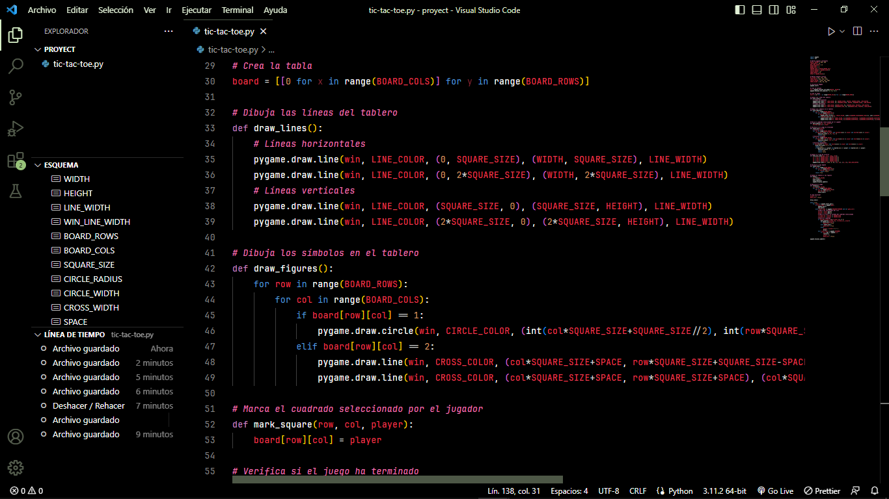
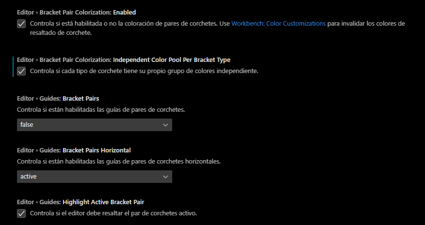

# ChatGPT Theme

Un tema para Visual Studio Code inspirado en el panel de entrada de código de ChatGPT.

## Instalacion

1. Abre la barra lateral de **Extensiones** en Visual Studio Code. `Ver → Extensiones`
2. Busca `ChatGPT Theme`
3. Haz clic en **Instalar**
4. Haz clic en **Recargar**
5. Abre la **Paleta de comandos** en Visual Studio Code. `Ver → Paleta de comandos`
6. Selecciona **Preferencias: Tema de color** y elige `ChatGPT Theme`.

## Recomendaciones

1. Prueba la fuente `JetBrains Mono` para mayor elegancia. [Fuente JetBrains Mono](https://www.jetbrains.com/lp/mono/)
2. Prueba los iconos `Helium Icon Theme` para tener una apariencia mas atractiva. [Iconos Helium Icon Theme](https://marketplace.visualstudio.com/items?itemName=helgardrichard.helium-icon-theme)
3. Busca y activa las opciones de `Bracket Pair` en `Archivo -> Preferencias -> Configuracion` para tener mas legibilidad al escribir codigo.

## Creditos

Este tema fue creado por [FreddMX](https://github.com/FreddMX) y está basado en ChatGPT de [OpeanAI](https://openai.com/).

## License

This project is licensed under the [MIT License](LICENSE.md).
